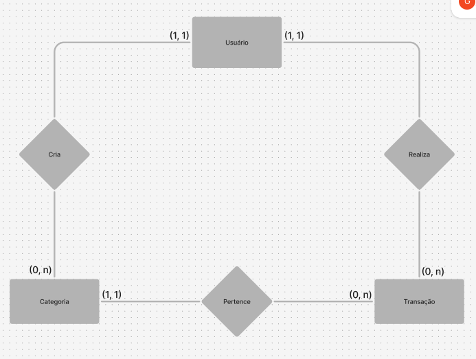

## Teste Técnico V_Lab

Teste técnico programado para o processo seletivo do v_lab. O Sql dump se encontra na pasta dump. Para restaurar o banco é necessário utilizar o seguinte comando do pgsql:

```
$ PGPASSWORD=pg_password psql --username pg_username database_name" < /dump/dump.sql
```

## Modelo Entidade Relacionamento


